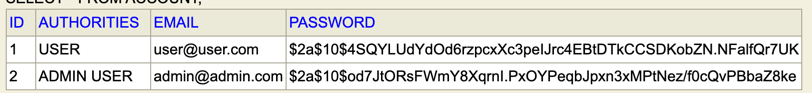

<h1 align="center">InstaCut</h1>


## :sparkles: Skills
- `Springboot`
- `H2 database`
- `React`
## :book: How to use
To clone and run this application
```
# Clone this repository
$ git clone https://github.com/Reene444/InstaCut.git
 
# Go into the repository
$ cd backend_apis

# Install dependencies
$ mvn clean package

# Run the app
$ java -jar target/backend_apis-0.0.1-SNAPSHOT.jar

# Read the swagger api document in the browser
$ link:localhost:8090/swagger-ui/index.html

# check the database in the browser
$ link:localhost:8090/db-console
/**
console information:
Diver class:org.h2.Driver
JDBC URL:jdbc:h2:file:./db/db
username:root
password:12345678
*/

# Go into the repository
$ cd frontend

# Run the app
$ npm start

//tips: have configed cors.
```
## :wrench: Functions 
(Ingrated with Insta apis)
1. [x] Photo Collection                                             
2. [ ] Photo Eidtor
3. [ ] Video Collection
4. [ ] Video Eidtor
5. [ ] Trending Videos Community 

## SeedData
| ID  | AUTHORITIES | EMAIL          | PASSWORD                                                       |
|-----|-------------|----------------|----------------------------------------------------------------|
| 1   | USER        | user@user.com  | $2a$10$4SQYLUdYdOd6rzpcxXc3peIJrc4EBtDTkCCSDKobZN.NFalfQr7UK    |
| 2   | ADMIN USER  | admin@admin.com| $2a$10$od7JtORsFWmY8XqrnI.PxOYPeqbJpxn3xMPtNez/f0cQvPBbaZ8ke   |

(the password is encripted by RSA)



## Apis:

## Page 
 :dash: [Demo](http://instacut.org/)

